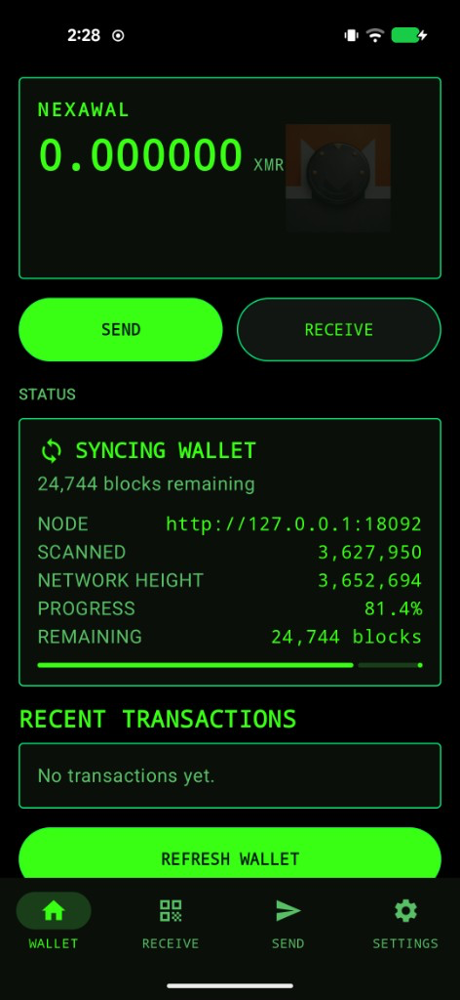
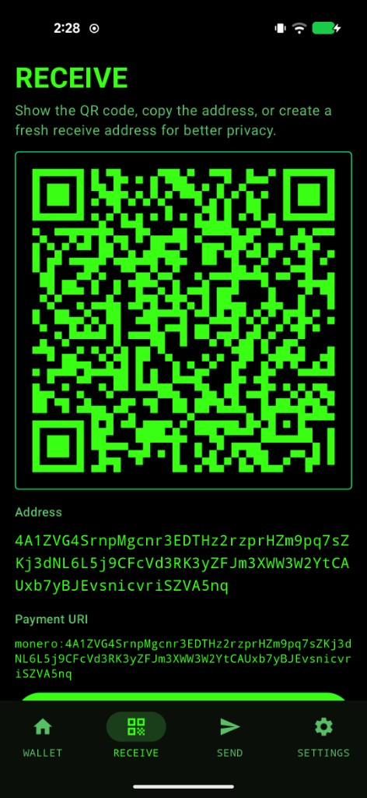
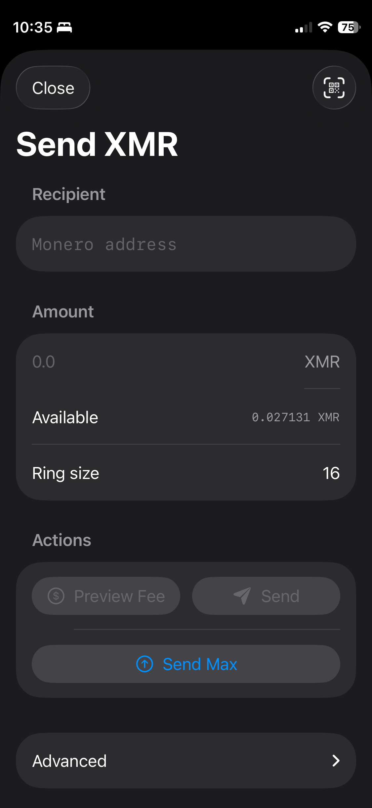
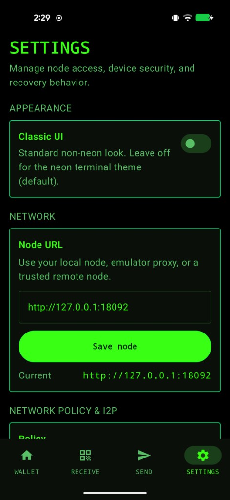

# nexawal-android

`nexawal-android` is the Android version of the NexaWal Monero wallet, built on top of `monero-oxide` and the shared wallet core.

- Android app: this repository
- iOS app: [nexawal](https://github.com/cacaosteve/nexawal)
- Rust wallet core / shared wallet core repo: [MoneroWalletCoreFFI](https://github.com/cacaosteve/MoneroWalletCoreFFI) (`walletcore/aligned-2026-07-18`, as a git submodule)
- Monero library work: [monero-oxide](https://github.com/cacaosteve/monero-oxide)

## Setup

```bash
git clone --recurse-submodules https://github.com/cacaosteve/nexawal-android.git
cd nexawal-android
./gradlew :app:assembleDebug
```

If you already cloned without submodules:

```bash
git submodule update --init --recursive
```

To move the submodule to the tip of `walletcore/aligned-2026-07-18`:

```bash
git submodule update --remote MoneroWalletCoreFFI
```

Gradle copies prebuilt `libmonerowalletcore.so` from `MoneroWalletCoreFFI/Artifacts/android/` into `walletcore/src/main/jniLibs/` on each build (no Rust required for a normal app build). You still need an Android NDK for `libc++_shared.so` and the JNI shim.

## Screenshots

| Wallet | Receive |
| --- | --- |
|  |  |

| Send | Settings |
| --- | --- |
|  |  |

## Notes

- Single-wallet Monero app
- Uses a native wallet core built from `monero-oxide`
- Android consumes the shared wallet core through native `.so` integration
- Syncs against standard Monero nodes, including local or remote nodes
